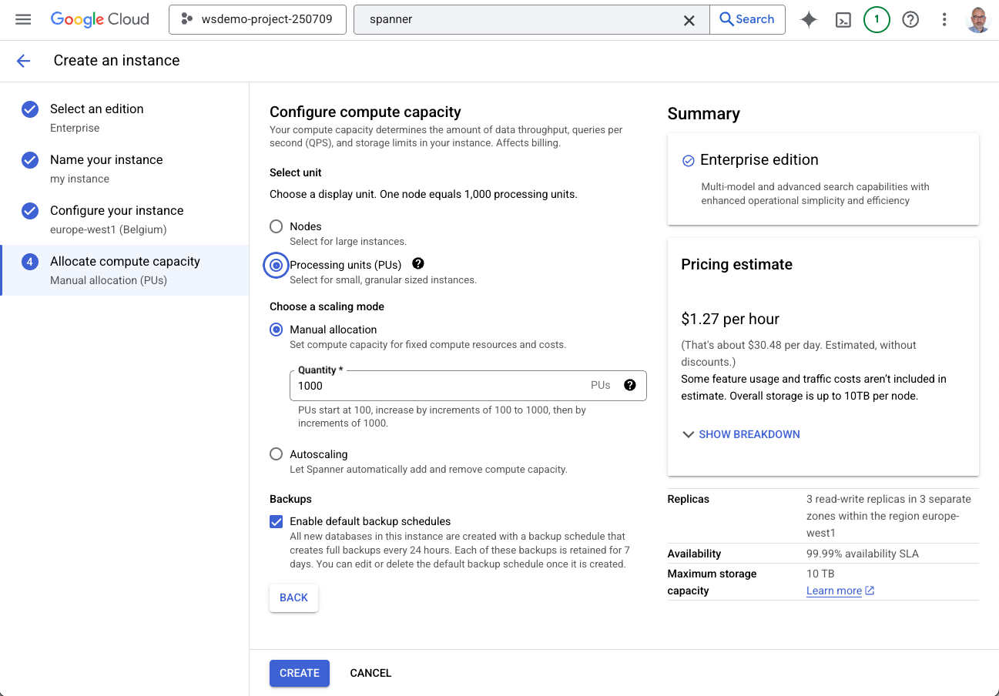

# Module 2 - Getting started

In this module you will:

- Create a Spanner instance
- Scale a Spanner instance
- Create a database
- Explore the Console and Spanner Studio

## Create an instance

First step is to create a new Spanner instance.

Open Spanner in the Console. You can do so by searching Spanner in the search box and selecting Spanner from the result list.


After selecting Spanner, the Console may take a few seconds to enable the Spanner API.

Click `CREATE PROVISIONED INSTANCE`


Under `Select an edition` select `Enterprise` and click `CONTINUE`.


Insert a name for the instance in the field `Instance name`. The `Instance ID` field is populated automatically.

Take note of the `Instance ID`; you need it for later tasks.

Click `CONTINUE`.


Under `Choose a configuration` select `Regional`.

In `Select a configuration` select a Google Cloud region.

Click `CONTINUE`.


Under `Select unit` select `Processing units (PU)`.

Select `Manual allocation` and insert `1000` in `Quantity`.

Click `CREATE`



Congratulations! Your new Spanner instance is ready to use.


## Scale an instance

Next step is to scale the instance down.

Click `EDIT INSTANCE` at the top of the Console.


Scroll down to the `Configure compute capacity` section.

Select `Processing units (PUs)`.

Select `Manual allocation`.

Insert `100` in the `Quantity` field.

Click `SAVE`.


Verify that the instance was properly scaled checking that `Compute capacity` now says `100 PUs (0 nodes)`.


## Create a database

Next we need a database.

Click `+ CREATE DATABASE`.


Insert a name for the database in the `Database name` field. Take note of the name for later tasks.

Under `Select database dialect` select `Google Standard SQL`.

Click `CREATE`.


The database is now ready.


## Explore the Console and Spanner Studio

Open Spanner in the Console. You can do so by searching Spanner in the search box and selecting Spanner from the result list.


The instance you have just created is listed at the bottom of the window.

Click on the name of the instance to open it.


The database you have just created is listed under `Databases` at the bottom of the window.

Click on the name of the database to open it.


Click `Spanner Studio` on the left of the window.


Click `QUICK TOUR` to review the elements of Spanner Studio's interface.

When prompted to try Gemini, simply close the message.


Type the following query in the empty Untitled query.

```sql
SELECT 'Hello Spanner' as message;
```

Click `RUN`.

The `RESULTS` tab at the bottom of the window displays the output of the query.


Click `EXPLANATION` to access they graphical query plan.

Click the `Expand` icon to expand the query output.


You can close the query tab by clicking on the X near "Untitled query".