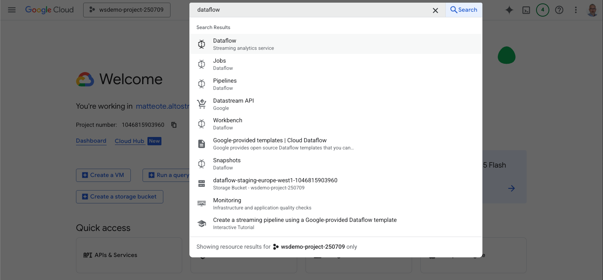
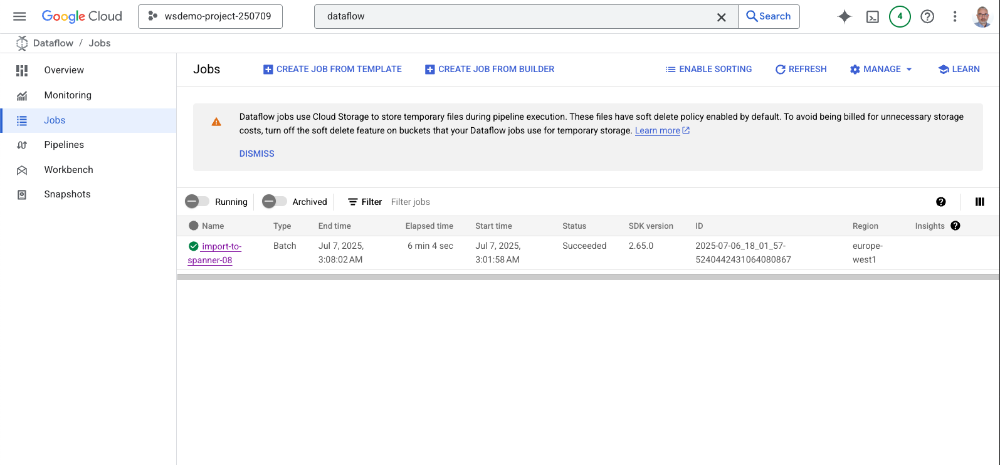
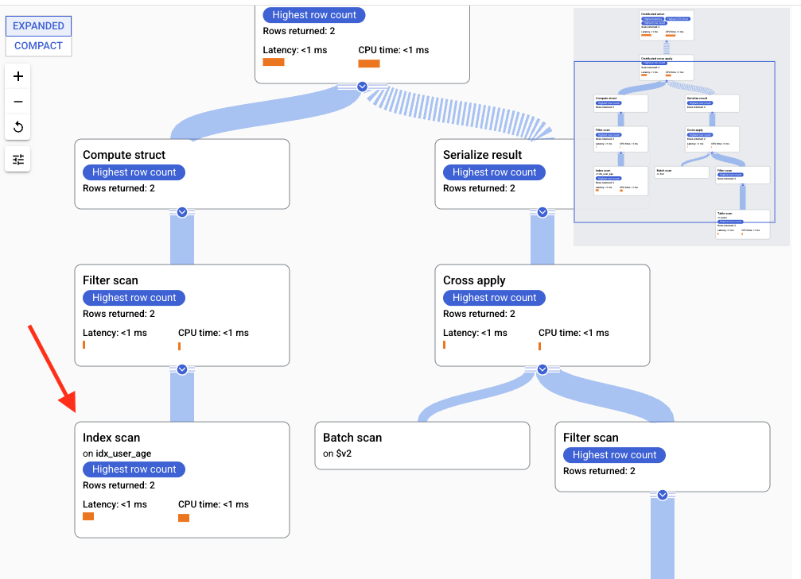
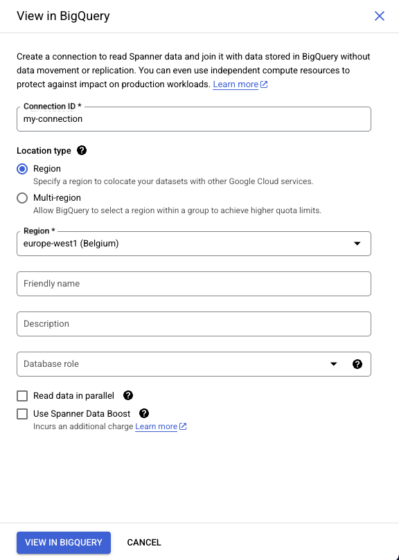

# Module 4 - Queries and Transactions

In this module you will:

- Insert data
  - Using DML in Spanner Studio
  - Using DML in gcloud
  - Using DML in Python
  - Using mutations in Python
  - Using Dataflow
- Query data
  - Using Spanner Studio
  - Examine a query plan
  - Using SQL in Python
  - Using the read API in Python
  - Using federated queries in BigQuery

## Insert data

### Using DML in Spanner Studio

You can insert data via DML statements in Spanner Studio.

Open a new query in Spanner Studio.

Run the following statement.

```sql
INSERT INTO users (username, location, age)
VALUES
('John Smith','US', 44),
('Mario Rossi', 'Italy', 50);
```

Note that `user_id` is not specified because it is populated automatically.

Verify that the data was inserted by running this query.

```sql
SELECT * FROM users;
```

### Using DML in gcloud

Take note of:

- The ID of the Spanner instance
- The name of the database

Open the Cloud Shell in Google Cloud Console (you may need to authorize it).

Run the following command.
Replace `INSTANCE_ID` with the ID of the Spanner instance.
Replace `DATABASE_NAME` with the name of the database.

```shell
gcloud spanner databases execute-sql DATABASE_NAME \
--instance=INSTANCE_ID \
--sql="INSERT INTO users(username, location, age) VALUES('Max Mustermann','Germany',55);"
```

Check the content of the table running this command.

```shell
gcloud spanner databases execute-sql DATABASE_NAME \
--instance=INSTANCE_ID \
--sql="SELECT * FROM users;"
```

### Using DML in Python

Review the following code that inserts a new record using DML using the Spanner client library.

```python
from google.cloud import spanner

instance_id = "INSERT YOUR INSTANCE ID"
database_id = "INSERT YOUR DATABASE NAME"

spanner_client = spanner.Client()
instance = spanner_client.instance(instance_id)
database = instance.database(database_id)

def execute_dml(transaction):
    row_count = transaction.execute_update("INSERT INTO users(username, location, age) VALUES('Taro Yamada','Japan',30);")
    print(f"{row_count} row(s) inserted.")

database.run_in_transaction(execute_dml)
print("DML statement executed successfully.")
```


> [!NOTE] 
> The code above does not use parameterization for simplicity.
> Parameterization is strongly recommended for performance and
> security reasons. To know more, review [Query data with parameter](https://cloud.google.com/spanner/docs/samples/spanner-query-with-parameter).

In Cloud Shell, click `Open Editor`.

Edit `dml.py`.

- Replace `INSERT YOUR INSTANCE ID` with the ID of the Spanner instance. 
- Replace `INSERT YOUR DATABASE NAME` with the name of the database.

Save the file.

In Cloud Shell Editor, click `Open Terminal`.

Run the following commands in Cloud Shell to execute the code.

```shell
cd module04
pip install -r requirements.txt
python dml.py
```

### Using Mutations in Python

Review the following code that inserts new records using mutations using the Spanner client library.

```python
from google.cloud import spanner

instance_id = "INSERT YOUR INSTANCE ID"
database_id = "INSERT YOUR DATABASE NAME"

spanner_client = spanner.Client()
instance = spanner_client.instance(instance_id)
database = instance.database(database_id)

def execute_mutation(transaction):
    transaction.insert(
        table="users",
        columns=("username", "location", "age"),
        values=[
            ('John Doe', 'US', 23),
            ('Matti Meikäläinen','Finland',71),
        ],
    )
    print("Inserted data.")

database.run_in_transaction(execute_mutation)
```

In Cloud Shell, click `Open Editor`.

Edit `mutations.py`.

- Replace `INSERT YOUR INSTANCE ID` with the ID of the Spanner instance. 
- Replace `INSERT YOUR DATABASE NAME` with the name of the database.

Save the file.

In Cloud Shell Editor, click `Open Terminal`.

Run the following commands in Cloud Shell to execute the code.

```shell
cd module04
python mutations.py
```

### Using Dataflow

Dataflow requires a default network (in its default configuration).

Check that a default network exists running this command in Cloud Shell.

```shell
gcloud compute networks list --filter="name=default"
```

If the default network does not exist, create it using these commands.

```shell
gcloud compute networks create default --subnet-mode=auto --mtu=1460 --bgp-routing-mode=regional --bgp-best-path-selection-mode=legacy && gcloud compute firewall-rules create default-allow-custom-2 --network=projects/$GOOGLE_CLOUD_PROJECT/global/networks/default --description=Allows\ connection\ from\ any\ source\ to\ any\ instance\ on\ the\ network\ using\ custom\ protocols. --direction=INGRESS --priority=65534 --source-ranges=10.128.0.0/9 --action=ALLOW --rules=all
```

Enable the Dataflow api.
The commands below disable the API first in case it was already enabled to make sure the right permissions are applied.
If your project already has Dataflow enabled and you cannot disable it or are not allowed to change it permissions, skip this step.

```shell
gcloud services disable dataflow.googleapis.com --force
gcloud services enable dataflow.googleapis.com
```

Create a storage bucket.
Replace BUCKET_NAME with a globally unique name.

```shell
gsutil mb gs://BUCKET_NAME
```

Edit `users-manifest.json`. Replace `BUCKET_NAME` with the name of the bucket you created.

Copy `users-manifest.json` and `users.csv` to the bucket.
Replace `BUCKET_NAME` in the command below with the name of the bucket you created.

```shell
gsutil cp users-manifest.json gs://BUCKET_NAME
gsutil cp users.csv gs://BUCKET_NAME
```

Start the Dataflow job.

- Replace `REGION` with the desired region (e.g. europe-west1)
- Replace `INSTANCE_ID` with the ID of the Spanner instance
- Replace `DATABASE` with the name of the database
- Replace `BUCKET_NAME` with the name of the bucket

```shell
gcloud dataflow jobs run import-csv-to-spanner \
--gcs-location gs://dataflow-templates-REGION/latest/GCS_Text_to_Cloud_Spanner \
--region REGION \
--parameters instanceId=INSTANCE_ID,databaseId=DATABASE,importManifest=gs://BUCKET_NAME/users-manifest.json
```

Open Dataflow in the Console.



Check the status of the job in the job list.



You can run a query in Spanner Studio to look at the new records.

```sql
SELECT * FROM users;
```

## Query data

### Using Spanner Studio

Open a new query in Spanner Studio and run the following statement.

```sql
SELECT * FROM users WHERE age > 50;
```

Expand the result pane.

Click `EXPLANATION`.

Verify that the bottom left node of the plan is an `Index scan` on the `idx_user_age` index that was previously created. This confirms the index is being used to filter on the `age` field.



### Using SQL in Python

Review the following code that reads records using SQL with the Spanner library for Python.

```python
from google.cloud import spanner

instance_id = "INSERT YOUR INSTANCE ID"
database_id = "INSERT YOUR DATABASE NAME"

spanner_client = spanner.Client()
instance = spanner_client.instance(instance_id)
database = instance.database(database_id)

with database.snapshot() as snapshot:
    results = snapshot.execute_sql("SELECT * FROM users WHERE age>50;")
    for row in results:
        print(row)
```

In Cloud Shell, click `Open Editor`.

Edit `sql.py`.

- Replace `INSERT YOUR INSTANCE ID` with the ID of the Spanner instance. 
- Replace `INSERT YOUR DATABASE NAME` with the name of the database.

Save the file.

In Cloud Shell Editor, click `Open Terminal`.

Run the following commands in Cloud Shell to execute the code.

```shell
cd module04
python sql.py
```

### Using the read API in Python

Review the following code that reads records using the read API of the Spanner library for Python.

```python
from google.cloud import spanner

instance_id = "INSERT YOUR INSTANCE ID"
database_id = "INSERT YOUR DATABASE NAME"

spanner_client = spanner.Client()
instance = spanner_client.instance(instance_id)
database = instance.database(database_id)

with database.snapshot() as snapshot:
    keyset = spanner.KeySet(all_=True)
    results = snapshot.read(
        table="users",
        columns=['user_id','username','location','age'],
        keyset=keyset
    )

    print(f"Data from table users:")
    for row in results:
        print(row)
```

In Cloud Shell, click `Open Editor`.

Edit `read_api.py`.

- Replace `INSERT YOUR INSTANCE ID` with the ID of the Spanner instance. 
- Replace `INSERT YOUR DATABASE NAME` with the name of the database.

Save the file.

In Cloud Shell Editor, click `Open Terminal`.

Run the following commands in Cloud Shell to execute the code.

```shell
cd module04
python read_api.py
```

### Using federated queries in BigQuery

Open a new query in Spanner Studio.

Click `VIEW IN BIGQUERY`. This creates a new connection.

Give an ID to the connection.

Select `Region` under `Location type.

Click `VIEW IN BIGQUERY`.



The BigQuery window opens, showing a query similar to this.

```sql
SELECT * FROM EXTERNAL_QUERY("matteote-spanner.europe-west1.my-connection", "SELECT * FROM INFORMATION_SCHEMA.TABLES;");
```

Replace `SELECT * FROM INFORMATION_SCHEMA.TABLES;` with `SELECT * FROM users WHERE age>50;`.

The query should now be similar to this.

```sql
SELECT * FROM EXTERNAL_QUERY("matteote-spanner.europe-west1.my-connection", "SELECT * FROM users WHERE age>50;");
```

Click `Run` to execute the query.