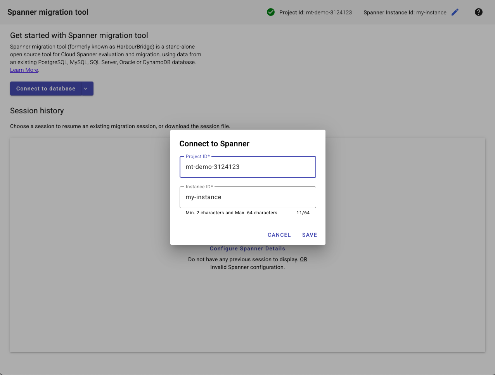
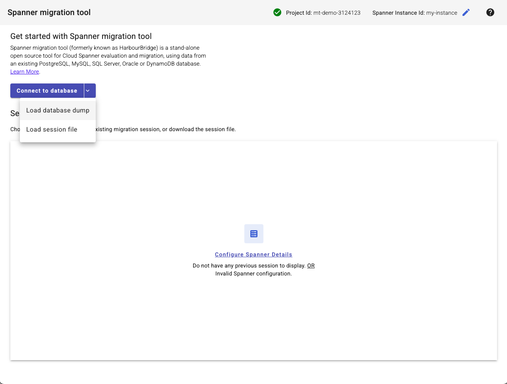
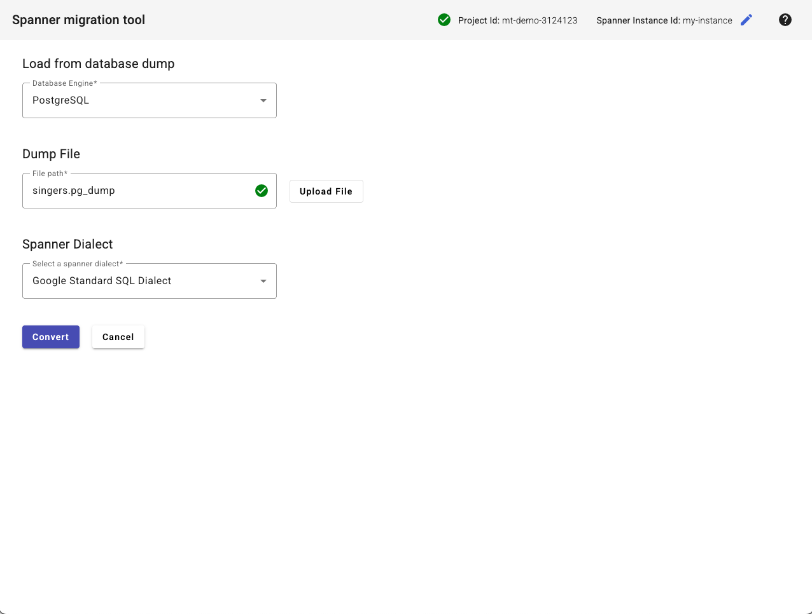
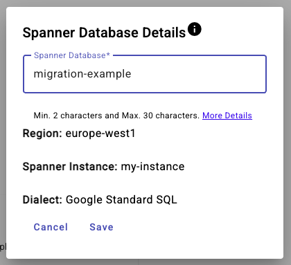
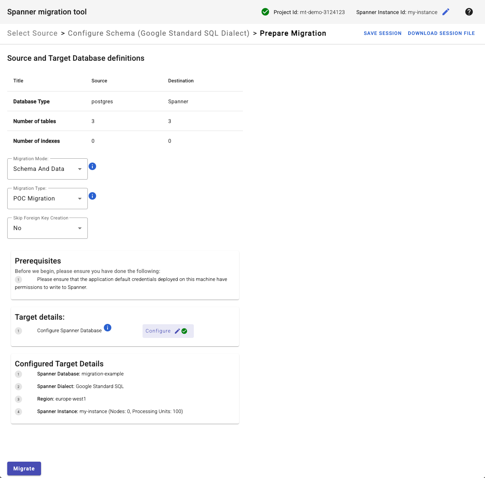
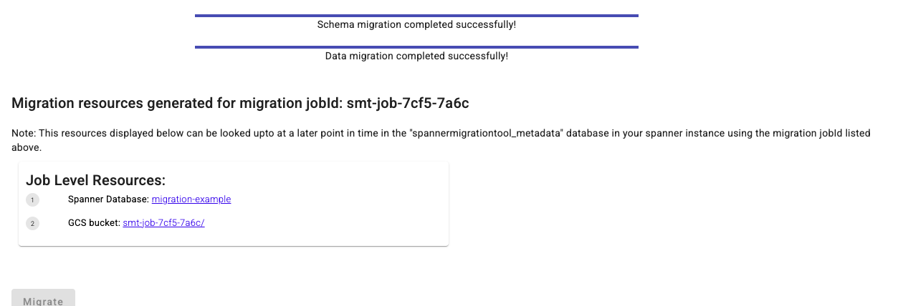
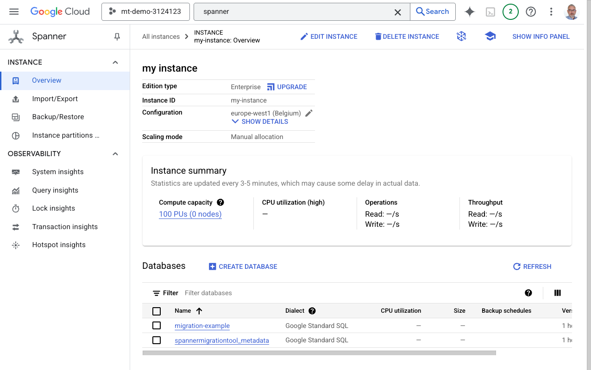
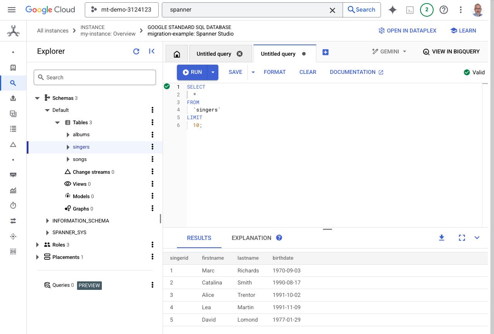

# Module 5 - Migration

In this module you will migrate an existing database (schema and data) to Spanner.

The migration is offline (based on a database dump).

Open the Cloud Shell.

Install the Spanner Migration Tool component.

```shell
sudo apt-get install -y google-cloud-sdk-spanner-migration-tool
```

Run the Spanner Migration Tool.

```shell
gcloud alpha spanner migrate web
```

Wait until the tool initialization completes.

When you see the message

```text
Starting Spanner migration tool UI at: http://localhost:8080
```

Click on `http://localhost:8080` in the Cloud Shell to open the Spanner Migration Tool UI.

Click on the "pen" icon on the top right of the window to edit the details of the Spanner instance. Click `Save` when done.



Expand `Connect to database` and select `Load database dump`.



Select `PostgreSQL` under `Database Engine`.

Download `singers.pg_dump` from the `module05` folder of this repository to a local directory on your machine.

Click `Upload File` in the Spanner Migration Tool UI and select the local copy of `singers.pg_dump` to upload it.

Select `Google Standard SQL Dialect` under `Spanner Dialect`.

Click `Convert`.



Click on each table and look at how the source schema was mapped to Spanner, including individual columns, keys and constraints.

When done, click `PREPARE MIGRATION`.


Select `Schema And Data` under `Migration Mode`.

Select `POC Migration` under `Migration Type`.

Under `Target details` click `Configure`, enter the name of the target database and click `Save`.



Click `Migrate`.



Wait for the migration to complete.



Open the Spanner instance in Console and refresh the list of databases. The database that was migrated is now visible.



Open the database and open Spanner Studio.

Review the newly created objects in object explorer and query the tables to confirm data has been migrated.

