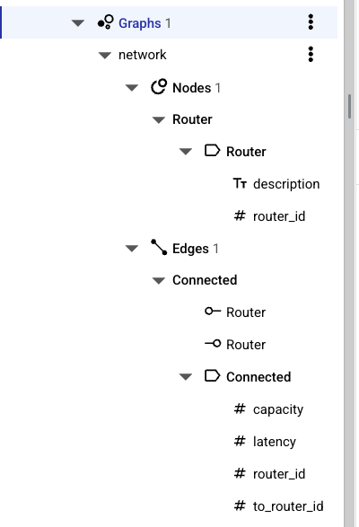
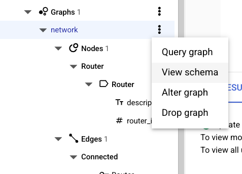

# Module 7 - Graph Schema Design

In this module you will:

- Create a graph
- Populate a graph

For the tasks below, you need Spanner Studio.

## Create a graph

Create the base tables.

Run the following script.

```sql
CREATE TABLE Router (
  router_id STRING(10) NOT NULL,
  description STRING(MAX)
) PRIMARY KEY (router_id);

CREATE TABLE Connected (
  router_id STRING(10) NOT NULL,
  to_router_id STRING(10) NOT NULL,
  `capacity` INT64 NOT NULL,
  latency INT64 NOT NULL,
  CONSTRAINT fk_router
    FOREIGN KEY (to_router_id)
    REFERENCES Router(router_id) NOT ENFORCED
) PRIMARY KEY (router_id, to_router_id)
  INTERLEAVE IN PARENT Router;

CREATE INDEX idx_ConnectedFrom ON
  Connected(to_router_id, router_id);
```

Create the graph.

Run the following script.

```sql
CREATE OR REPLACE PROPERTY GRAPH network
NODE TABLES (
  Router
)
EDGE TABLES (
  Connected
    SOURCE KEY (router_id) REFERENCES Router
    DESTINATION KEY (to_router_id) REFERENCES Router
)
```

Expand the graph in object explorer to check the information available.



Click on the menu of the `network` graph and select `View schema` to open the DDL of the schema in a new query tab.



## Populate a graph

Populating a graph uses regular SQL DML statements.

Open `graph_data.sql` from `module07` directory.

Copy the content into a new query in Spanner Studio and run it.