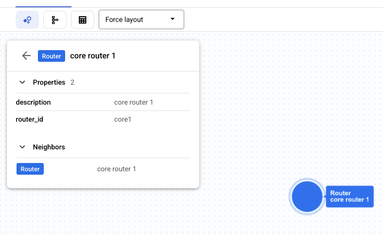
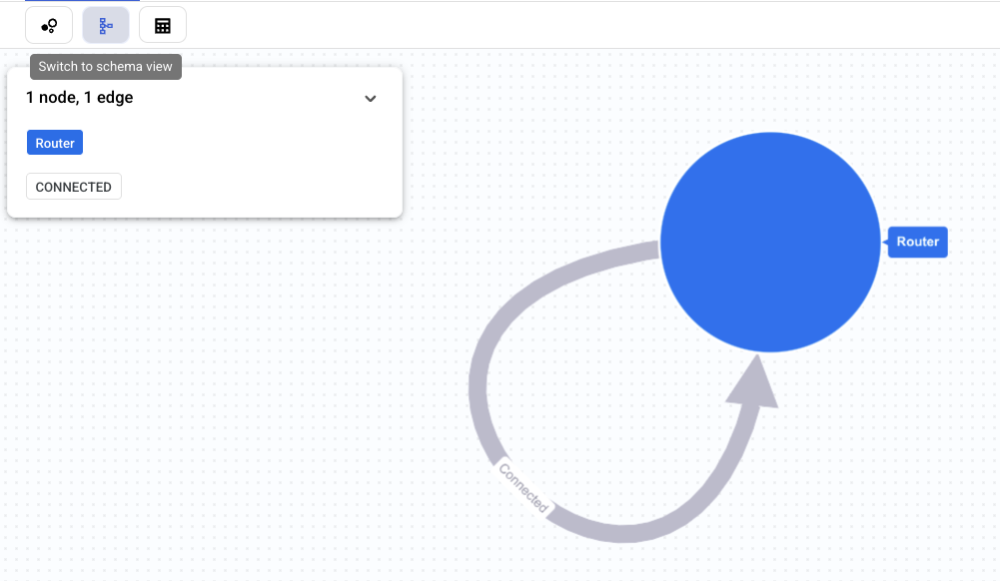
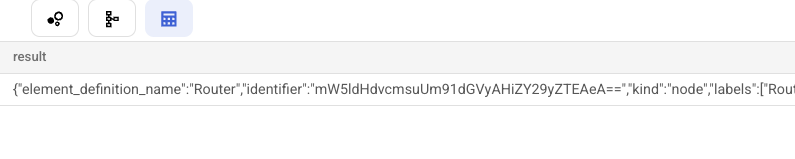
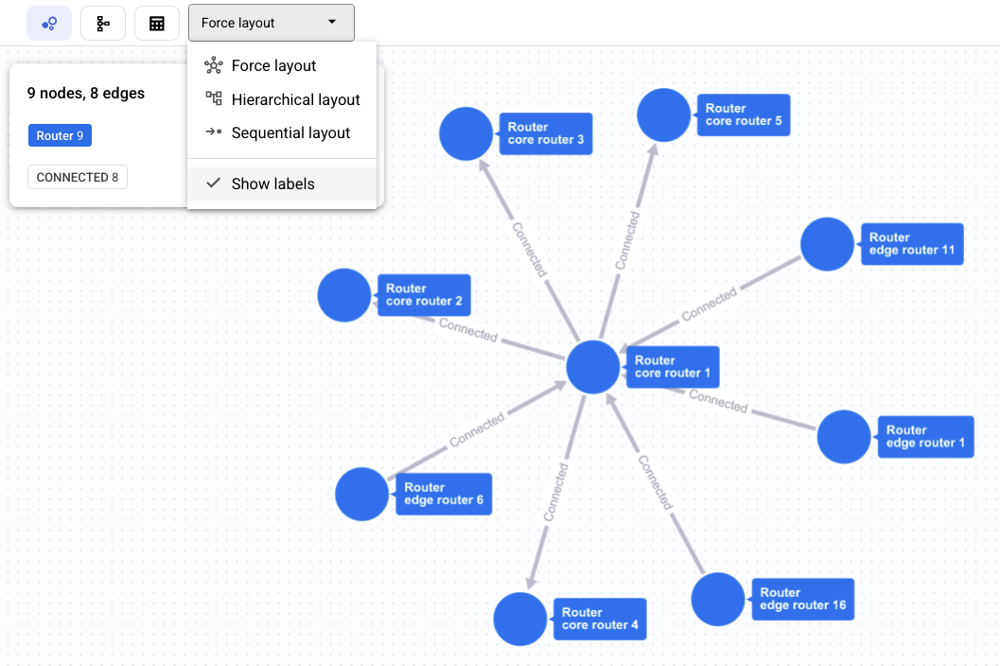
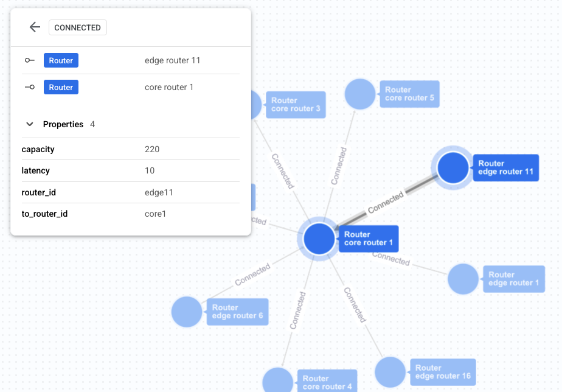
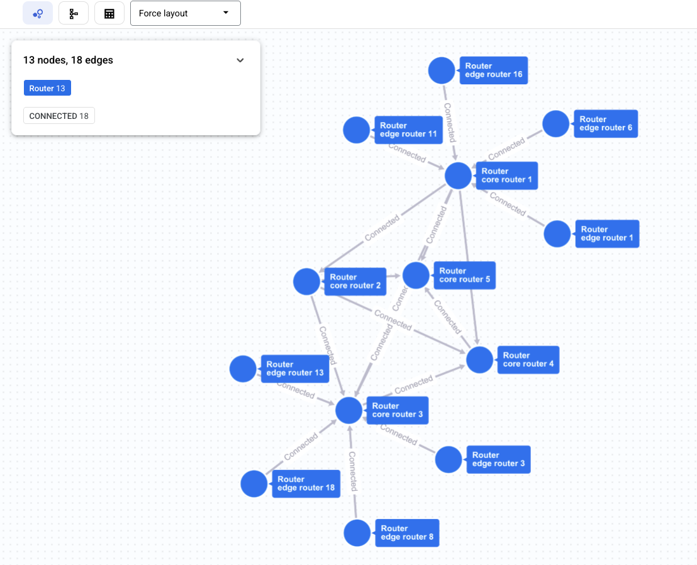
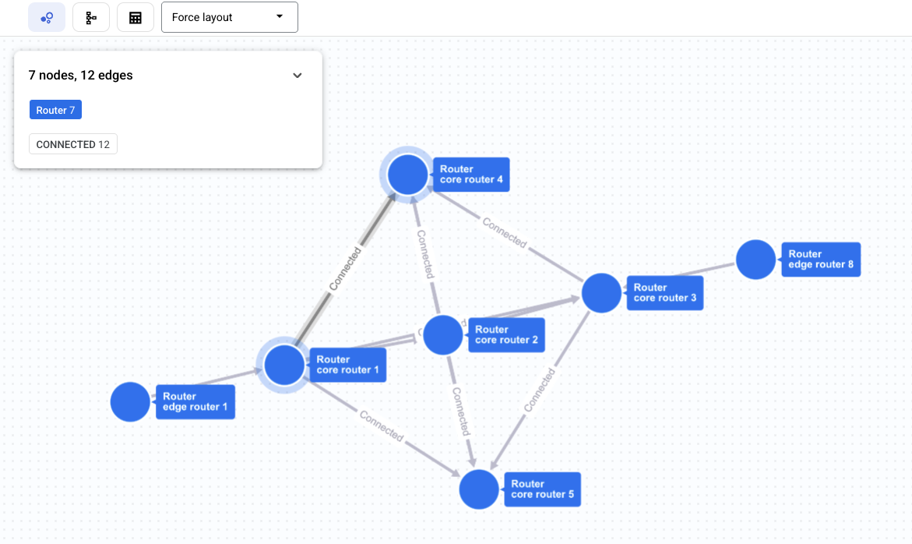
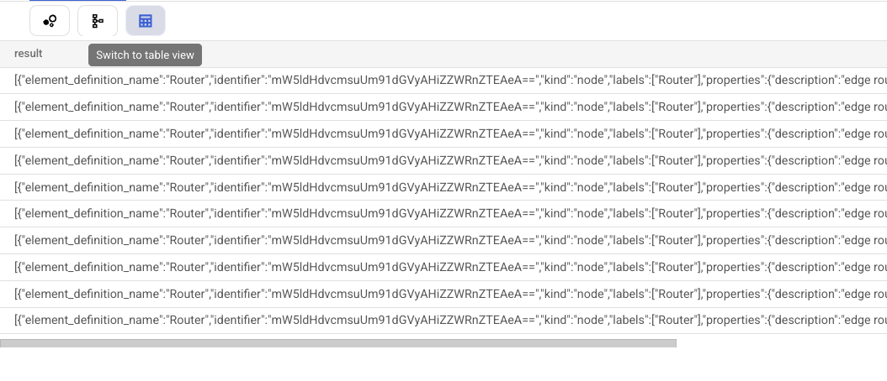

# Module 11 - Visualization

In this module you will create visualizations of the queries from Module 9 using Spanner Studio.

## Query visualization

Run this query.

```sql
graph network
match (r:Router {router_id: "core1"})
return SAFE_TO_JSON(r) as result
```

The query returns only one node.

Click on the node to visualize its properties.



Click on the schema button to show the schema view.

The schema view summarizes the type of nodes and edges and how they are connected.



Click on the table button to show the table view with the raw JSON output.



Run this query to show all neighbours of router `core1`.

```sql
graph network
match p=(:Router {router_id: "core1"})-[:Connected]-(:Router)
return SAFE_TO_JSON(p) as result
```

Open the layout menu and select `Show labels` to display the labels.



Click on an edge to display its properties.



Run this query to find all paths between two edge routers.

```sql
graph network
match p=(:Router {router_id: 'edge1'})-[:Connected]-{1,5}(:Router {router_id: 'edge8'})
return SAFE_TO_JSON(p) as result
```



The result does not seem correct. It contains many edge routers that are not part of the filter.

This is actually correct. The query is not directed and makes no distinction between core and edge routers so, when traversing the graph, Spanner reaches the edge routers and goes back.

To get a better result we must ask Spanner to skip nodes that it already visited.

Run this variant that adds the `acyclic` path mode.

```sql
graph network
match p= acyclic (:Router {router_id: 'edge1'})-[:Connected]-{1,5}(:Router {router_id: 'edge8'})
return SAFE_TO_JSON(p) as result
```

The result looks better.



Click on the table button to show the table view with the raw JSON output of each path.


