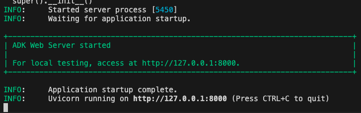
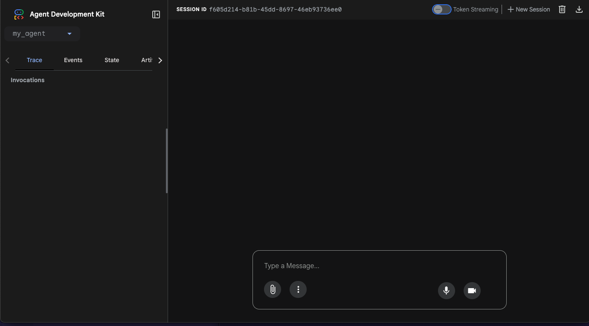
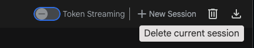

# Module 13 - Agents - Activity 1

In this activity you create a basic AI agent using the [Agent Development Kit (ADK)](https://google.github.io/adk-docs) for Python.

## Region selection

Some of the exercises require to select a region.

Make sure to always use the same region.

If you are running the exercises in Europe, use `europe-west1`.

## Setup

### Enable the Vertex AI API

Run this command to enable the Vertex AI API.

```shell
gcloud services enable aiplatform.googleapis.com
```

### Create a new directory

Create a new directory for your AI agents.

The new directory is placed directly under home.

```shell
mkdir ~/agents
```

### Initialize a Python virtual environment

Initialize and activate a new Python virtual environment in the directory you have just created.

```shell
cd ~/agents
python -m venv ./.venv
source ./.venv/bin/activate
```

### Install the ADK

Install the ADK using pip.

```shell
pip install google-adk
```

### Create the directory structure for your agent

You need to create a subdirectory under `~/agents` and three files.

The result should look like this:

```text
~/agents
    my_agent/
        __init__.py
        agent.py
        .env
```

You can create the necessary directory and files using this script:

```shell
cd ~/agents
mkdir my_agent
echo "from . import agent" > my_agent/__init__.py
touch my_agent/agent.py
touch my_agent/.env
```

Populate `agent.py` with the following code:

```python
from google.adk.agents import Agent

root_agent = Agent(
    name="root_agent",
    model="gemini-2.0-flash",
    description=(
        "Agent to answer questions about the time."
    ),
    instruction=(
        "You are a helpful agent who can answer user questions about the time. Do not answer questions that are not related to time."
    )
)
```

Populate `.env` with the following content.

- Replace `YOUR_PROJECT_ID` with you project ID.
- Replace `LOCATION` with the region you are using.

```shell
GOOGLE_GENAI_USE_VERTEXAI=TRUE
GOOGLE_CLOUD_PROJECT=YOUR_PROJECT_ID
GOOGLE_CLOUD_LOCATION=LOCATION
```

### Login to set the Application Default Credentials

Run the following command to login and provide the Application Default Credentials.

If you are prompted `Do you want to continue (Y/n)?` press `Y`.

```shell
gcloud auth application-default login
```

The command provides a URL for the authentication. Depending on your environment you can either open it directly with Control/Cmd+Click or copy and paste it into a browser.

After you have authenticated with you Google Cloud user you will receive an authorization code.

Copy the authorization code and paste it into the command line shell.

## Run the agent

Run the following command to start the ADK web interface and run the agent:

```shell
cd ~/agent
adk web
```

You should get an output like this:



You can Control/Cmd+Click the `http://127.0.0.1:8000` link to open the interface in a new browser tab.

The new tab should look similar to:



### Experiment with some prompts

> How tall is an elephant?

When prompted with topics not related to time, the agent informs the user that it cannot answer.

> What's the time?

When prompted about the current time, the agent may be unable to answer or may provide an inaccurate time; it is relying exclusively on the knowledge of the LLM.

### Stop the agent

1. Close the browser tab of the agent.
2. Return to the shell that is running `adk web`.
3. Press `Control+C` to stop `adk`.

## Add a tool

Add a tool that allows the agent to retrieve the current time.

Modify `agent.py` as follows:

```python
from google.adk.agents import Agent
from datetime import datetime

def get_current_time() -> str:
    """
    Returns the current time in HH:MM format.

    Args:
    None

    Output:
    str: The current time in HH:MM format.
    """
    return datetime.now().strftime("%H:%M")

root_agent = Agent(
    name="root_agent",
    model="gemini-2.0-flash",
    description=(
        "Agent to answer questions about the time."
    ),
    instruction=(
        """You are a helpful agent who can answer user questions about the time.
        Do not answer questions that are not related to time.
        Use the get_current_time tool to retrieve the current time."""
    ),
    tools = [get_current_time]
)
```

Start ADK:

```shell
cd ~/agent
adk web
```

### Experiment with some prompts

> What's the time?

With the new tool, the agent provides the actual current time.

> How long until 23:00?

Based on the LLM, the agent may be able to compute the difference.

> If the current time is BST, what is the time in New York?

Based on the LLM, the agent may be unable to convert between time zones.

Close the current session by clicking on the trashcan and start a new one:



Now enter this prompt first:

> How long until 23:00?

You may receive a response like this if you are using Gemini 2.0 Flash:

> I cannot calculate the time until 23:00 without knowing the current time. Please provide the current time.

The LLM cannot figure out that it can use the tool to retrieve the time.

### Stop the agent

1. Close the browser tab of the agent.
2. Return to the shell that is running `adk web`.
3. Press `Control+C` to stop `adk`.

## Experiment with a different LLM

To overcome the challenge with the last prompt, let's try to upgrade to a newer Gemini model.

In `agent.py`, replace `gemini-2.0-flash` with `gemini-2.5-flash`.

Start ADK:

```shell
cd ~/agent
adk web
```

Try the last prompt again:

> How long until 23:00?

This time the agent should invoke the tool immediately and answer the question.

This is an example of how different models may perform differently when handling the same task.